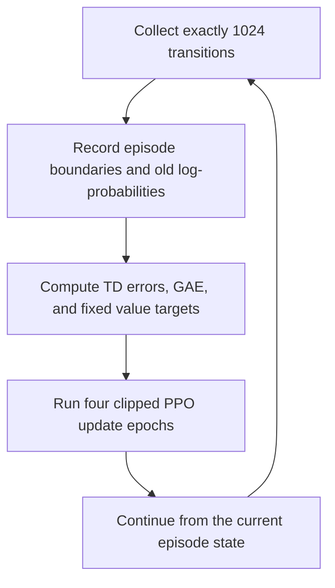

# Level 17: Fixed-Length PPO Rollouts and Boundary-Aware GAE

This level turns the episode-based PPO agent from Level 16 into a **fixed-length rollout** trainer.

Instead of collecting exactly one complete episode before every update, the agent collects exactly $T=1024$ environment transitions. A rollout may contain several complete episodes, and it may finish in the middle of another episode. This creates a new challenge: the implementation must distinguish a true terminal state, an environment truncation, an episode reset, and the artificial end of the rollout buffer.

The result is a more realistic PPO data pipeline built around fixed batch sizes, persistent episode accounting, and boundary-aware Generalized Advantage Estimation (GAE).

## Learning objectives

- Collect a fixed number of transitions per PPO update.
- Allow one rollout to contain parts of multiple episodes.
- Carry an unfinished episode safely into the next rollout.
- Track completed episode returns independently of update boundaries.
- Distinguish true termination from truncation.
- Use separate masks for value bootstrapping and GAE recursion.
- Prevent advantages from leaking across environment resets.
- Bootstrap correctly when a rollout ends in the middle of an episode.
- Reuse one fixed rollout for several clipped PPO epochs.
- Interpret rollout-level and episode-level training diagnostics.

## What changes in this level?

Level 16 used one complete episode as one PPO training batch. Level 17 instead uses a rollout with a fixed number of transitions:

$$
T=1024.
$$

In the script, $T$ is configured by `ROLLOUT_STEPS`.

The number of transitions per update is now predictable even though CartPole episodes have different lengths.

One rollout can look conceptually like this:

```text
episode A ending | complete episode B | beginning of episode C
<-------------------- 1024 transitions -------------------->
```

Episode C is not discarded. Its observation, accumulated return, and accumulated length are carried into the next rollout.

## Actor and critic

The actor represents the categorical policy

$$
\pi_\theta(a\mid s)
$$

with a `4 → 32 → 2` neural network:

```text
observation → Linear(4, 32) → Tanh → Linear(32, 2) → logits
```

The critic estimates

$$
V_\phi(s)
$$

with a separate `4 → 32 → 1` neural network:

```text
observation → Linear(4, 32) → Tanh → Linear(32, 1) → value
```

The actor and critic have separate Adam optimizers and do not share parameters.

## Fixed-length rollout collection

At each environment step, the policy samples

$$
A_t\sim\pi_{\theta_{\mathrm{old}}}(\cdot\mid S_t),
$$

and the collector stores the transition

$$
\left(
S_t,\,
A_t,\,
R_{t+1},\,
S_{t+1}
\right).
$$

It also stores the selected action's old log-probability:

$$
\ell_t^{\mathrm{old}}
\mathrel{=}
\log\pi_{\theta_{\mathrm{old}}}(A_t\mid S_t).
$$

Collection runs under `torch.no_grad()`. Therefore, the rollout data and old log-probabilities are fixed samples from the behavior policy and do not retain an autograd graph.

The rollout dictionary contains:

| Field | Meaning |
| --- | --- |
| `states` | Observations $S_t$ used to choose actions. |
| `actions` | Sampled actions $A_t$. |
| `rewards` | Rewards $R_{t+1}$. |
| `next_states` | Observations $S_{t+1}$ returned by the environment. |
| `terminated` | True only when the underlying task terminates. |
| `episode_ends` | True when an episode terminates or is truncated. |
| `old_log_probs` | Detached $\log\pi_{\theta_{\mathrm{old}}}(A_t\mid S_t)$. |

## Rollout boundaries and episode boundaries

These boundaries are not the same.

- A **rollout boundary** occurs after exactly `ROLLOUT_STEPS` transitions.
- An **episode boundary** occurs when Gymnasium reports `terminated` or `truncated`.
- A rollout may cross several episode boundaries.
- An episode may cross from one rollout into the next.

The collector therefore receives and returns:

- the current observation;
- the running return of the current unfinished episode;
- the running length of the current unfinished episode.

Only completed episodes are added to `episode_returns` and `episode_lengths`. If the rollout ends mid-episode, its partial statistics remain in the running accumulators until that episode actually ends.

## Why two masks are necessary

Define the true-termination indicator

$$
d_t=
\begin{cases}
1, & \text{if the transition truly terminates the task},\\
0, & \text{otherwise},
\end{cases}
$$

and the episode-end indicator

$$
e_t=
\begin{cases}
1, & \text{if the episode terminates or is truncated},\\
0, & \text{otherwise}.
\end{cases}
$$

The code constructs two different masks.

### Bootstrap mask

$$
b_t=1-d_t.
$$

This mask decides whether the TD target may use $V_\phi(S_{t+1})$.

### Trace mask

$$
c_t=1-e_t.
$$

This mask decides whether GAE may continue recursively from the following stored transition.

The distinction is essential:

| Transition type | $b_t$ | $c_t$ | Bootstrap from $S_{t+1}$? | Carry the GAE trace forward? |
| --- | ---: | ---: | --- | --- |
| Ordinary transition | $1$ | $1$ | Yes | Yes |
| True termination | $0$ | $0$ | No | No |
| Time-limit truncation | $1$ | $0$ | Yes | No |
| Final rollout item, episode continues | $1$ | $1$ | Yes | No later buffer item exists |

At a truncation, the underlying state can still have future value, so bootstrapping remains valid. However, Gymnasium resets the environment before the next collected transition. The GAE trace must stop so that rewards and TD errors from the new episode do not leak backward into the old one.

At a pure rollout boundary, no reset occurs. The final TD error still bootstraps from the critic's estimate of the next state. The backward recursion ends because the buffer ends, with the accumulator initialized to zero.

## Boundary-aware one-step TD error

For each rollout transition, the implementation computes

$$
\delta_t
\mathrel{=}
R_{t+1}
+\gamma b_tV_\phi(S_{t+1})
-V_\phi(S_t).
$$

Using $b_t=1-d_t$ gives

$$
\delta_t
\mathrel{=}
R_{t+1}
+\gamma(1-d_t)V_\phi(S_{t+1})
-V_\phi(S_t).
$$

For a true terminal transition, $d_t=1$, so

$$
\delta_t
\mathrel{=}
R_{t+1}-V_\phi(S_t).
$$

For an ordinary transition, a truncation, or the end of a nonterminal rollout, $d_t=0$, so the next-state value remains in the target.

## Boundary-aware GAE

The GAE recursion is

$$
\hat{A}_t
\mathrel{=}
\delta_t
+\gamma\lambda c_t\hat{A}_{t+1},
$$

or equivalently,

$$
\hat{A}_t
\mathrel{=}
\delta_t
+\gamma\lambda(1-e_t)\hat{A}_{t+1}.
$$

The recursion is evaluated backward through the rollout with

$$
\hat{A}_T=0.
$$

The expanded form is

$$
\hat{A}_t
\mathrel{=}
\delta_t
+(\gamma\lambda)c_t\delta_{t+1}
+(\gamma\lambda)^2c_tc_{t+1}\delta_{t+2}
+\cdots.
$$

As soon as an episode-end mask is zero, later TD errors cannot cross that boundary.

The critic target is then

$$
\hat{V}_t^{\mathrm{target}}
\mathrel{=}
\hat{A}_t+V_\phi(S_t).
$$

The values, next-state values, raw advantages, and value targets are computed once under `torch.no_grad()` before the PPO epoch loop. The target therefore remains fixed while the critic is optimized.

## Advantage normalization

The actor uses a normalized copy of the raw GAE advantages:

$$
\widetilde{A}_t
\mathrel{=}
\frac{
\hat{A}_t-\mu_{\hat{A}}
}{
\sigma_{\hat{A}}+\epsilon_{\mathrm{num}}
}.
$$

The implementation uses the population standard deviation:

```python
raw_advantages.std(unbiased=False)
```

Normalization is performed once per rollout, not once per PPO epoch. This keeps the actor's learning signal fixed across all update epochs.

The critic still uses targets built from the unnormalized advantages.

## PPO probability ratio

During optimization, the current actor re-evaluates each stored action:

$$
\ell_t^{\mathrm{new}}
\mathrel{=}
\log\pi_\theta(A_t\mid S_t).
$$

The probability ratio is

$$
r_t(\theta)
\mathrel{=}
\frac{
\pi_\theta(A_t\mid S_t)
}{
\pi_{\theta_{\mathrm{old}}}(A_t\mid S_t)
}
\mathrel{=}
\exp\left(
\ell_t^{\mathrm{new}}-\ell_t^{\mathrm{old}}
\right).
$$

The same stored actions must be used for the old and new probabilities. No action is resampled inside the PPO update.

## Clipped surrogate objective

The clipped ratio is

$$
\bar{r}_t(\theta)
\mathrel{=}
\min\left(
\max\left(r_t(\theta),1-\epsilon\right),
1+\epsilon
\right).
$$

This project uses

$$
\epsilon=0.2,
$$

so the clipped ratios lie in

$$
[0.8,1.2].
$$

The unclipped and clipped surrogate terms are

$$
U_t(\theta)=r_t(\theta)\widetilde{A}_t
$$

and

$$
C_t(\theta)=\bar{r}_t(\theta)\widetilde{A}_t.
$$

PPO selects the elementwise conservative term:

$$
L_t^{\mathrm{CLIP}}(\theta)
\mathrel{=}
\min\left(
U_t(\theta),
C_t(\theta)
\right).
$$

Clipping limits the incentive for excessively large beneficial policy changes while preserving penalties for changes in a harmful direction.

## Actor loss

For a rollout containing $T$ transitions, the entropy-regularized actor loss is

$$
L_{\mathrm{actor}}
\mathrel{=}
-\frac{1}{T}
\sum_{t=0}^{T-1}
L_t^{\mathrm{CLIP}}(\theta)
-\beta
\frac{1}{T}
\sum_{t=0}^{T-1}
\mathcal{H}\left(
\pi_\theta(\cdot\mid S_t)
\right).
$$

The entropy coefficient is

$$
\beta=0.01.
$$

Because the optimizer minimizes the loss, the negative entropy term rewards policies that retain some exploration.

## Critic loss

The critic minimizes mean squared error against the fixed GAE value targets:

$$
L_{\mathrm{critic}}
\mathrel{=}
\frac{1}{T}
\sum_{t=0}^{T-1}
\left(
V_\phi(S_t)
-\hat{V}_t^{\mathrm{target}}
\right)^2.
$$

Critic predictions are recomputed during every PPO epoch, but the targets are not.

## Multiple update epochs

Every 1024-step rollout is reused for

$$
K=4
$$

full-rollout optimization epochs.

During each epoch:

1. the current policy produces logits for all stored states;
2. new log-probabilities are calculated for the stored actions;
3. ratios and clipped surrogate values are calculated;
4. the scalar actor loss is optimized;
5. current critic predictions are recomputed;
6. the scalar critic loss is optimized.

The following data remain fixed across the four epochs:

- states and actions;
- rewards and boundary flags;
- old log-probabilities;
- normalized actor advantages;
- critic value targets.

The new log-probabilities, ratios, entropy, and critic predictions can change after each optimizer step.

## Training flow



The environment is reset only when an episode ends, not when a rollout ends.

## Tensor shapes

For rollout length $T=1024$:

| Tensor | Shape |
| --- | --- |
| `states`, `next_states` | `[T, 4]` |
| `actions` | `[T]` |
| `rewards` | `[T]` |
| `terminated`, `episode_ends` | `[T]` |
| `old_log_probs`, `new_log_probs` | `[T]` |
| policy `logits` | `[T, 2]` |
| `values`, `next_values` | `[T]` |
| TD errors | `[T]` |
| raw and normalized advantages | `[T]` |
| `value_targets` | `[T]` |
| ratios and surrogate terms | `[T]` |
| actor and critic losses | scalar |

Keeping all per-transition quantities one-dimensional avoids accidental broadcasting into a $T\times T$ matrix.

## Training configuration

| Parameter | Value |
| --- | ---: |
| Environment | `CartPole-v1` |
| PPO updates | `100` |
| Transitions per rollout | `1024` |
| Total planned environment steps | `102400` |
| Discount factor $\gamma$ | `0.99` |
| GAE parameter $\lambda$ | `0.95` |
| PPO clipping parameter $\epsilon$ | `0.2` |
| Update epochs per rollout | `4` |
| Entropy coefficient $\beta$ | `0.01` |
| Actor learning rate | `3e-4` |
| Critic learning rate | `1e-3` |
| Hidden dimension | `32` |
| Minibatches | None; the full rollout is used each epoch |
| Console report interval | `50` updates |
| Return moving-average window | `50` completed episodes |
| Evaluation episodes | `20` |
| Base seed | `32268` |

The number of environment interactions after update $u$ is

$$
N_{\mathrm{steps}}=uT.
$$

Therefore:

$$
N_{\mathrm{steps}}(50)=50\times1024=51200,
$$

and

$$
N_{\mathrm{steps}}(100)=100\times1024=102400.
$$

The training curve is saved as:

```text
ppo_rollout_cartpole.png
```

## Implementation map

| Component | Purpose |
| --- | --- |
| `PolicyNetwork` | Produces categorical action logits. |
| `ValueNetwork` | Predicts one scalar state value per observation. |
| `collect_rollout(...)` | Collects exactly 1024 transitions while handling any episode boundaries inside the rollout. |
| `collect_episode(...)` | Collects one complete episode for evaluation. |
| `compute_gae(...)` | Computes boundary-aware TD errors, GAE advantages, and value targets. |
| `rollout_to_tensors(...)` | Converts aligned rollout fields to tensors with the required dtypes. |
| `calculate_ppo_terms(...)` | Computes log-ratios, ratios, clipping, and both surrogate terms. |
| `update_ppo_from_rollout(...)` | Performs four full-rollout actor and critic update epochs. |
| `train(...)` | Alternates fixed-length collection and PPO optimization for 100 updates. |
| `moving_average(...)` | Smooths completed-episode returns over full windows. |
| `plot_training_history(...)` | Saves raw and moving-average episode-return curves. |
| `evaluate_policy(...)` | Runs separately seeded complete evaluation episodes. |

## Episode statistics

Training updates and completed episodes have different counters.

After one rollout:

$$
N_{\mathrm{completed}}
\neq 1
$$

in general. A single rollout can complete many short episodes, one long episode, or no episode at all.

The implementation keeps:

- `total_environment_steps` for interaction count;
- `episode_returns` for returns of completed episodes;
- `episode_lengths` for lengths of completed episodes;
- `running_episode_return` for the unfinished episode;
- `running_episode_length` for the unfinished episode.

Using `list.extend(...)` for completed returns and lengths is important because one rollout returns a list containing zero or more completed episodes.

## Interpreting the diagnostics

### Mean of recent returns

This is the mean return of the most recent 50 **completed episodes**, not the mean of the most recent 50 rollouts.

### Actor loss

The actor loss may be small or change sign. Normalized advantages contain both positive and negative values, and the entropy bonus also contributes to the result.

### Critic loss

The critic loss can be numerically much larger than the actor loss because it measures squared error in return units. Judge it together with returns, finite-value checks, and the critic's learning trend.

### Policy entropy

For a two-action categorical policy, the maximum entropy is

$$
\log 2\approx0.693.
$$

Entropy near this value indicates nearly equal action probabilities. Lower entropy indicates a more confident policy.

### Mean ratio

The mean ratio is

$$
\bar{r}
\mathrel{=}
\frac{1}{T}
\sum_{t=0}^{T-1}
r_t.
$$

It should usually remain reasonably close to $1$. However, a mean near $1$ does not prove that every individual ratio is near $1$.

### Ratio range

The minimum and maximum show the most extreme changes in stored-action probability. The original ratios may move outside $[0.8,1.2]$; only the clipped copies are mathematically restricted to that interval.

### Clip fraction

The implementation reports

$$
f_{\mathrm{clip}}
\mathrel{=}
\frac{1}{T}
\sum_{t=0}^{T-1}
\mathbf{1}
\left[
\left|r_t-1\right|>\epsilon
\right].
$$

| Clip fraction | Interpretation |
| ---: | --- |
| `0.0` | No ratio crossed the clipping boundary during that epoch. |
| Between `0` and `1` | Some rollout samples crossed the boundary. |
| Near `1.0` | Most samples crossed it, suggesting a very aggressive policy update. |

A clip fraction of zero is valid, especially with a small actor learning rate and only four epochs.

### Final update epoch

This should be `4`, confirming that the rollout was reused for all configured optimization epochs.

### Environment steps

This should increase by exactly `1024` after each PPO update.

### Completed episodes

This counter should increase only when CartPole reports termination or truncation. It is not expected to equal the update number.

## Critical implementation invariants

A correct fixed-rollout PPO implementation should preserve all of the following:

- Every training rollout contains exactly `ROLLOUT_STEPS` transitions.
- All rollout fields have the same leading length $T$.
- `old_log_probs` are detached and remain fixed across PPO epochs.
- New log-probabilities are calculated for stored actions, not newly sampled actions.
- The bootstrap mask is derived only from true termination.
- The trace mask is derived from termination or truncation.
- The GAE loop uses the mask for the current index, $c_t$.
- No GAE term crosses an episode reset.
- A nonterminal rollout ending still uses the final next-state value.
- Raw advantages and value targets are computed once and remain detached.
- Actor advantages are normalized once per rollout.
- The actor and critic losses are finite scalars.
- Actor and critic optimizers clear gradients before backpropagation.
- Completed episode statistics are appended with `extend`.
- Partial episode statistics survive across rollout boundaries.
- Evaluation uses complete episodes rather than fixed-length training rollouts.

## Validation checks

A focused test suite for this level should verify:

1. rollout collection returns exactly the requested number of transitions;
2. all stored rollout fields are aligned and have the same length;
3. one rollout can record multiple completed episodes;
4. an unfinished episode's observation, return, and length carry into the next rollout;
5. a true termination disables both bootstrapping and GAE continuation;
6. a truncation allows bootstrapping but stops GAE continuation;
7. GAE does not leak across an episode reset;
8. the final nonterminal rollout item uses $V_\phi(S_{t+1})$;
9. old log-probabilities and advantages do not require gradients;
10. equal old and new log-probabilities produce ratios of one;
11. clipped ratios lie within $[1-\epsilon,1+\epsilon]$;
12. positive- and negative-advantage surrogate cases match hand calculations;
13. actor and critic parameters both change after an update;
14. value targets remain fixed across all update epochs;
15. total environment steps increase by the rollout length;
16. completed episode histories are flat numeric lists, not nested lists;
17. evaluation runs complete episodes and returns one score per evaluation seed.

### Hand-checking a truncation boundary

Suppose transition $t$ is truncated but not truly terminated:

$$
d_t=0,
\qquad
e_t=1.
$$

Then

$$
b_t=1,
\qquad
c_t=0.
$$

The TD error is

$$
\delta_t
\mathrel{=}
R_{t+1}
+\gamma V_\phi(S_{t+1})
-V_\phi(S_t),
$$

but the advantage is

$$
\hat{A}_t=\delta_t.
$$

The next collected transition belongs to a reset environment, so its TD error cannot influence $\hat{A}_t$.

## Run the project

Install the dependencies:

```bash
python -m pip install numpy gymnasium torch matplotlib pytest
```

From the Level 17 directory:

```bash
python ppo_rollout_cartpole.py
```

If the level's tests are stored in the same directory:

```bash
python -m pytest -q
```

## Level 16 versus Level 17

| Property | Level 16: episode PPO | Level 17: rollout PPO |
| --- | --- | --- |
| Training batch | One complete episode | Exactly 1024 transitions |
| Batch size | Variable | Fixed |
| Episodes per batch | Exactly one | Zero, one, or many |
| Episode may span batches | No | Yes |
| Boundary information | True termination | True termination and episode end |
| GAE masks | One termination mask | Separate bootstrap and trace masks |
| Partial episode statistics | Not required | Carried across rollouts |
| Training counter | Episodes | PPO updates and environment steps |
| PPO epochs | Four | Four |
| Minibatches | None | None |

Level 17 does not change PPO's clipped objective. It changes how experience is collected, segmented, masked, and accounted for.

## Connection to language-model PPO and RLVR

Fixed-length rollout batches are closer to the data pipelines used in large-scale reinforcement learning.

For language models:

- a generated token acts like an action;
- token log-probabilities play the role of action log-probabilities;
- different sequences have different lengths;
- masks prevent padded or unrelated sequence positions from sharing credit;
- rollouts are grouped into batches before policy updates;
- the old policy's selected-token log-probabilities remain fixed while the current policy is optimized.

The boundary-aware idea in this project is directly relevant: advantage information must follow the intended trajectory structure and must not leak into a different reset episode or unrelated sequence.

Production language-model PPO or RLVR additionally requires attention masks, sequence-level rewards, reward assignment across tokens, reference-policy constraints, distributed rollout generation, minibatching, checkpointing, and large-model optimization.

## Scope and limitations

This educational implementation includes:

- fixed-length on-policy rollout collection;
- multiple episodes inside a rollout;
- partial episodes across rollout boundaries;
- separate bootstrap and trace masks;
- boundary-aware GAE;
- advantage normalization;
- PPO probability ratios and clipping;
- entropy regularization;
- repeated full-rollout optimization epochs;
- separate actor and critic networks;
- rollout and episode diagnostics.

It does not include:

- vectorized parallel environments;
- minibatch sampling or shuffling;
- value-function clipping;
- gradient-norm clipping;
- target-KL early stopping;
- learning-rate scheduling;
- observation or reward normalization;
- model checkpointing;
- deterministic greedy evaluation.

Evaluation remains stochastic because actions are sampled from the categorical policy rather than selected with `argmax`.

## Current-code naming note

Training duration is controlled by `NUM_UPDATES`. In the current script:

- `NUM_EPISODES` is a legacy constant used only when forming the evaluation seed offset;
- `REPORT_EVERY` controls reporting;
- `REPORT_EVERY_UPDATES` is currently unused.

These constants do not change the algorithm, but renaming or removing the legacy values would make the configuration easier to read.

## Main takeaway

Fixed-length PPO rollouts require two different ideas of “done”:

$$
\boxed{
\delta_t
\mathrel{=}
R_{t+1}
+\gamma(1-d_t)V_\phi(S_{t+1})
-V_\phi(S_t)
}
$$

uses true termination to control value bootstrapping, while

$$
\boxed{
\hat{A}_t
\mathrel{=}
\delta_t
+\gamma\lambda(1-e_t)\hat{A}_{t+1}
}
$$

uses every episode boundary to control GAE recursion.

This separation lets PPO train on predictable 1024-transition batches without losing valid bootstrap information or mixing credit across environment resets.
