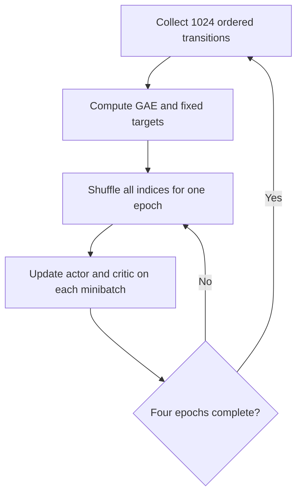

# Level 18: PPO Minibatches, Shuffling, and Weighted Metrics

This level extends the fixed-length PPO trainer from Level 17 by replacing each full-rollout optimizer step with a sequence of **shuffled minibatch updates**.

The agent still collects an on-policy rollout of $N=1024$ transitions, computes boundary-aware Generalized Advantage Estimation (GAE), and freezes the rollout policy's log-probabilities. The new step is to shuffle all rollout indices at the beginning of every PPO epoch, split them into minibatches of at most 64 samples, and perform one actor and one critic optimizer step per minibatch.

This is much closer to the standard training structure used in practical PPO implementations.

## Learning objectives

- Generate one random permutation of all rollout indices per update epoch.
- Split that permutation into complete minibatches and an optional smaller final minibatch.
- Include every rollout sample exactly once in each epoch.
- Slice every aligned rollout tensor with the same minibatch indices.
- Keep old log-probabilities, advantages, and value targets fixed.
- Perform one actor and one critic update per minibatch.
- Understand the difference between rollout size, minibatch size, and optimizer-step count.
- Aggregate diagnostics across every minibatch in the final epoch.
- Weight means correctly when minibatches have unequal sizes.
- Preserve all boundary-aware GAE and PPO clipping rules from Levels 17 and 16.

## What changes from Level 17?

Level 17 performed one full-rollout actor update and one full-rollout critic update per PPO epoch:

$$
\text{one rollout}\longrightarrow\text{one optimizer step per network}.
$$

Level 18 splits the same rollout into shuffled subsets:

$$
\text{one rollout}
\longrightarrow
\text{many minibatches}
\longrightarrow
\text{many optimizer steps per network}.
$$

With rollout size $N=1024$ and minibatch size $M=64$, the number of minibatches per epoch is

$$
B=\left\lceil\frac{N}{M}\right\rceil
=\left\lceil\frac{1024}{64}\right\rceil
=16.
$$

With $K=4$ PPO epochs, each rollout produces

$$
K B=4\times16=64
$$

actor optimizer steps and 64 critic optimizer steps.

## What remains unchanged?

The following Level 17 behavior is retained:

- exactly 1024 transitions are collected per rollout;
- a rollout may contain parts of several episodes;
- an unfinished episode may continue into the next rollout;
- true termination controls value bootstrapping;
- termination or truncation controls GAE recursion;
- old selected-action log-probabilities are stored during collection;
- raw advantages and critic targets are computed once;
- actor advantages are normalized once over the complete rollout;
- PPO uses stored actions and the clipped probability-ratio objective;
- evaluation collects complete stochastic-policy episodes.

The algorithmic change is inside the optimization stage, after the rollout-level targets have already been prepared.

## Actor and critic

The actor represents

$$
\pi_\theta(a\mid s)
$$

with a `4 → 32 → 2` categorical-policy network:

```text
observation → Linear(4, 32) → Tanh → Linear(32, 2) → logits
```

The critic estimates

$$
V_\phi(s)
$$

with a separate `4 → 32 → 1` network:

```text
observation → Linear(4, 32) → Tanh → Linear(32, 1) → value
```

The networks use separate Adam optimizers.

## Why use minibatches?

A full-rollout update calculates one gradient from every sample at once. A minibatch update calculates several noisier gradients from smaller shuffled subsets.

Minibatches provide:

- more optimizer steps from one rollout;
- lower memory use for larger models and rollout buffers;
- randomized sample groupings across epochs;
- a training structure that scales naturally to larger datasets;
- a foundation for vectorized environments and larger PPO systems.

The tradeoff is that metrics and bookkeeping become more delicate. Reporting only the last random minibatch does not summarize the full epoch.

## Creating minibatch indices

The helper `make_minibatch_indices(...)` first creates one permutation:

$$
p^{(k)}
\mathrel{=}
\mathrm{randperm}(N),
$$

where $k$ is the PPO epoch.

For minibatch number $j$, the index tensor is

$$
I_j^{(k)}
\mathrel{=}
p^{(k)}
\left[
jM:
\min\left((j+1)M,N\right)
\right].
$$

The implementation follows this structure:

```python
permutation = torch.randperm(num_samples, device=device)

for start in range(0, num_samples, minibatch_size):
    end = start + minibatch_size
    indices.append(permutation[start:end])
```

There must be one call to `torch.randperm(...)` per epoch, not one call per minibatch. Recreating a full permutation inside the minibatch loop can repeat some samples and omit others.

## Required minibatch guarantees

For every epoch, the returned index tensors must satisfy three properties.

### Complete coverage

$$
\bigcup_{j=0}^{B-1} I_j^{(k)}
\mathrel{=}
\{0,1,\ldots,N-1\}.
$$

Every rollout sample appears.

### No duplication

$$
I_j^{(k)}\cap I_l^{(k)}=\varnothing
\qquad
\text{for }j\neq l.
$$

Every rollout sample appears exactly once in the epoch.

### Valid total size

$$
\sum_{j=0}^{B-1}n_j=N,
\qquad
n_j=\left|I_j^{(k)}\right|.
$$

The helper should also reject

$$
N\leq0
$$

or

$$
M\leq0
$$

with `ValueError`.

## Smaller final minibatches

The rollout size does not have to be divisible by the minibatch size.

For example, with

$$
N=10,
\qquad
M=4,
$$

the minibatch sizes are

$$
[4,4,2].
$$

The last minibatch is smaller, but it must not be discarded. This ensures that every on-policy sample contributes once per epoch.

If $M>N$, the result is one minibatch containing all $N$ indices.

The number of minibatches is always

$$
B=\left\lceil\frac{N}{M}\right\rceil.
$$

## Compute temporal quantities before shuffling

GAE depends on reverse temporal order. It must be computed over the ordered rollout before any random minibatch selection.

Define the true-termination indicator $d_t$ and episode-end indicator $e_t$. The one-step TD error is

$$
\delta_t
=R_{t+1}
+\gamma(1-d_t)V_\phi(S_{t+1})
-V_\phi(S_t).
$$

The boundary-aware GAE recursion is

$$
\hat{A}_t
=\delta_t
+\gamma\lambda(1-e_t)\hat{A}_{t+1},
\qquad
\hat{A}_N=0.
$$

The fixed critic target is

$$
\hat{V}_t^{\mathrm{target}}
=\hat{A}_t+V_\phi(S_t).
$$

GAE must **not** be recomputed independently inside shuffled minibatches. After shuffling, adjacent rows are generally unrelated in time.

## Normalize advantages before splitting

The actor advantages are normalized once using all $N$ rollout samples:

$$
\widetilde{A}_i
\mathrel{=}
\frac{
\hat{A}_i-\mu_{\hat{A}}
}{
\sigma_{\hat{A}}+\epsilon_{\mathrm{num}}
}.
$$

The same normalized values are then indexed into minibatches.

Normalizing each minibatch separately would make the learning signal depend on its random grouping and would produce unstable behavior for very small final minibatches.

## Fixed data across epochs

Before the epoch loop, the implementation computes and freezes:

- `old_log_probs`;
- raw GAE advantages;
- normalized actor advantages;
- critic value targets.

These quantities do not change during any minibatch update.

At the start of each new epoch, only the index ordering is regenerated:

$$
p^{(1)},p^{(2)},\ldots,p^{(K)}.
$$

Each sample is therefore used once per epoch and $K=4$ times across the complete PPO update.

## Aligned minibatch slicing

For one index tensor `indices`, every training tensor must use the same selection:

```python
state = states[indices]
action = actions[indices]
old_log_prob = old_log_probs[indices]
advantage = actor_advantages[indices]
value_target = value_targets[indices]
```

Using different permutations for different fields would destroy the transition alignment. For example, an action could be paired with the wrong state or advantage.

## PPO ratio inside a minibatch

For each sample $i$ in minibatch $I_j$, the current policy evaluates the stored action:

$$
\ell_i^{\mathrm{new}}
\mathrel{=}
\log\pi_\theta(A_i\mid S_i).
$$

The probability ratio is

$$
r_i(\theta)
\mathrel{=}
\exp\left(
\ell_i^{\mathrm{new}}-\ell_i^{\mathrm{old}}
\right).
$$

The clipped ratio is

$$
\bar{r}_i(\theta)
\mathrel{=}
\min\left(
\max\left(r_i(\theta),1-\epsilon\right),
1+\epsilon
\right),
$$

with

$$
\epsilon=0.2.
$$

The conservative surrogate is

$$
L_i^{\mathrm{CLIP}}(\theta)
\mathrel{=}
\min\left(
r_i(\theta)\widetilde{A}_i,
\bar{r}_i(\theta)\widetilde{A}_i
\right).
$$

## Minibatch actor loss

For minibatch $I_j$ containing $n_j$ samples, the actor loss is

$$
L_{\mathrm{actor},j}
\mathrel{=}
-\frac{1}{n_j}
\sum_{i\in I_j}
L_i^{\mathrm{CLIP}}(\theta)
-\beta
\frac{1}{n_j}
\sum_{i\in I_j}
\mathcal{H}\left(
\pi_\theta(\cdot\mid S_i)
\right),
$$

where

$$
\beta=0.01.
$$

The actor performs one `zero_grad() → backward() → step()` sequence for every minibatch.

## Minibatch critic loss

The critic loss for minibatch $I_j$ is

$$
L_{\mathrm{critic},j}
\mathrel{=}
\frac{1}{n_j}
\sum_{i\in I_j}
\left(
V_\phi(S_i)-\hat{V}_i^{\mathrm{target}}
\right)^2.
$$

The target is fixed, but the critic's predictions are recomputed using its current parameters for every minibatch.

The critic also performs one optimizer step per minibatch.

## Update schedule



For the default configuration:

| Quantity | Calculation | Value |
| --- | ---: | ---: |
| Rollout samples | $N$ | 1024 |
| Minibatch size | $M$ | 64 |
| Minibatches per epoch | $\lceil N/M\rceil$ | 16 |
| PPO epochs | $K$ | 4 |
| Actor steps per rollout | $K\lceil N/M\rceil$ | 64 |
| Critic steps per rollout | $K\lceil N/M\rceil$ | 64 |
| Times each sample is used | $K$ | 4 |

Across 100 rollouts, the planned optimizer-step count for each network is

$$
100\times64=6400.
$$

## Why final-minibatch metrics are insufficient

The final minibatch is a random subset of the rollout. It may also be smaller than every other minibatch.

Reporting only that batch can make the displayed diagnostics:

- noisy;
- dependent on random ordering;
- unrepresentative of the final epoch;
- incorrectly weighted when the final batch is smaller.

The implementation should aggregate metrics across **all minibatches of the final PPO epoch**.

Earlier epochs still train the networks, but only the final epoch contributes to the reported summary.

## Sample-weighted metric aggregation

Let the final epoch contain $B$ minibatches with sizes

$$
n_0,n_1,\ldots,n_{B-1},
$$

and total sample count

$$
N=\sum_{j=0}^{B-1}n_j.
$$

If $x_j$ is a scalar minibatch mean, its correct epoch mean is

$$
\bar{x}
\mathrel{=}
\frac{
\sum_{j=0}^{B-1}n_jx_j
}{
\sum_{j=0}^{B-1}n_j
}.
$$

The required weight is the number of samples in the current minibatch:

```python
batch_size = indices.numel()
```

It is **not** the number of minibatches.

### Aggregated actor loss

$$
\bar{L}_{\mathrm{actor}}
\mathrel{=}
\frac{
\sum_{j=0}^{B-1}
n_jL_{\mathrm{actor},j}
}{
N
}.
$$

### Aggregated critic loss

$$
\bar{L}_{\mathrm{critic}}
\mathrel{=}
\frac{
\sum_{j=0}^{B-1}
n_jL_{\mathrm{critic},j}
}{
N
}.
$$

### Aggregated entropy

Because `entropies` contains one value per sample, its epoch mean is

$$
\bar{\mathcal{H}}
\mathrel{=}
\frac{
\sum_{j=0}^{B-1}
\sum_{i\in I_j}\mathcal{H}_i
}{
N
}.
$$

The implementation can accumulate `entropies.sum().item()` and divide once by $N$.

### Aggregated mean ratio

$$
\bar{r}
\mathrel{=}
\frac{
\sum_{j=0}^{B-1}
\sum_{i\in I_j}r_i
}{
N
}.
$$

### Aggregated clip fraction

Define the clipped-sample indicator

$$
q_i
\mathrel{=}
\mathbf{1}
\left[
\left|r_i-1\right|>\epsilon
\right].
$$

Then the final-epoch clip fraction is

$$
f_{\mathrm{clip}}
\mathrel{=}
\frac{
\sum_{j=0}^{B-1}
\sum_{i\in I_j}q_i
}{
N
}.
$$

This guarantees

$$
0\leq f_{\mathrm{clip}}\leq1.
$$

### Global ratio range

The epoch-level ratio range is

$$
r_{\min}
\mathrel{=}
\min_j\min_{i\in I_j}r_i,
$$

and

$$
r_{\max}
\mathrel{=}
\max_j\max_{i\in I_j}r_i.
$$

The range must combine every final-epoch minibatch rather than reuse only the last one.

## Why simple averaging can be wrong

Suppose three minibatches have sizes

$$
[4,4,2]
$$

and scalar mean losses

$$
[1,3,10].
$$

The unweighted mean of the three batch means is

$$
\frac{1+3+10}{3}
\mathrel{=}
\frac{14}{3}
\approx4.67.
$$

That incorrectly gives the two-sample minibatch the same influence as each four-sample minibatch.

The sample-weighted mean is

$$
\frac{
4(1)+4(3)+2(10)
}{
4+4+2
}
\mathrel{=}
\frac{36}{10}
=3.6.
$$

The weighted result is equal to the mean that would be obtained by combining all ten per-sample values.

When every minibatch has the same size, weighted and unweighted batch means happen to agree. Correct weighting is still important because it makes the implementation valid for arbitrary rollout and minibatch sizes.

## Tensor shapes

Before minibatch selection, the rollout tensors have:

| Tensor | Full-rollout shape |
| --- | --- |
| `states`, `next_states` | `[N, 4]` |
| `actions` | `[N]` |
| `rewards` | `[N]` |
| `terminated`, `episode_ends` | `[N]` |
| `old_log_probs` | `[N]` |
| raw and normalized advantages | `[N]` |
| `value_targets` | `[N]` |

For a minibatch containing $n_j$ samples:

| Tensor | Minibatch shape |
| --- | --- |
| `state` | `[n_j, 4]` |
| `action` | `[n_j]` |
| `old_log_prob`, `new_log_prob` | `[n_j]` |
| `advantage` | `[n_j]` |
| `value_target` | `[n_j]` |
| policy `logits` | `[n_j, 2]` |
| ratios, entropies, surrogate terms | `[n_j]` |
| actor and critic losses | scalar |

The final minibatch may have $n_j<M$.

## Training configuration

| Parameter | Value |
| --- | ---: |
| Environment | `CartPole-v1` |
| PPO updates | `100` |
| Rollout size $N$ | `1024` |
| Minibatch size $M$ | `64` |
| Minibatches per epoch | `16` |
| PPO epochs $K$ | `4` |
| Actor and critic steps per rollout | `64` each |
| Total planned environment steps | `102400` |
| Discount factor $\gamma$ | `0.99` |
| GAE parameter $\lambda$ | `0.95` |
| Clipping parameter $\epsilon$ | `0.2` |
| Entropy coefficient $\beta$ | `0.01` |
| Actor learning rate | `3e-4` |
| Critic learning rate | `1e-3` |
| Hidden dimension | `32` |
| Console report interval | `50` updates |
| Return moving-average window | `50` completed episodes |
| Evaluation episodes | `20` |
| Base seed | `32268` |

The number of environment interactions after update $u$ remains

$$
N_{\mathrm{steps}}=uN.
$$

Minibatching increases the number of optimizer steps, not the number of environment interactions.

The current script saves the return curve as:

```text
ppo_rollout_cartpole.png
```

## Implementation map

| Component | Purpose |
| --- | --- |
| `PolicyNetwork` | Produces categorical action logits. |
| `ValueNetwork` | Predicts one scalar state value per observation. |
| `collect_rollout(...)` | Collects a fixed 1024-transition on-policy rollout. |
| `collect_episode(...)` | Collects complete episodes for evaluation. |
| `make_minibatch_indices(...)` | Shuffles every rollout index once and divides the permutation into minibatches. |
| `compute_gae(...)` | Computes ordered, boundary-aware advantages and value targets before shuffling. |
| `rollout_to_tensors(...)` | Converts aligned rollout fields into tensors. |
| `calculate_ppo_terms(...)` | Computes ratios, clipped ratios, and conservative surrogates. |
| `update_ppo_from_rollout(...)` | Runs shuffled minibatch actor and critic updates over four epochs. |
| `train(...)` | Alternates rollout collection and minibatch PPO optimization. |
| `moving_average(...)` | Smooths completed-episode returns. |
| `plot_training_history(...)` | Saves the training-return curve. |
| `evaluate_policy(...)` | Evaluates the stochastic policy on complete seeded episodes. |

## Interpreting the diagnostics

The displayed PPO metrics should summarize all samples in the final epoch.

### Actor and critic losses

These are sample-weighted means of the final epoch's minibatch losses. They are not the losses of the final random minibatch.

### Mean entropy

For CartPole's two actions,

$$
\mathcal{H}_{\max}=\log2\approx0.693.
$$

The reported value should remain in the valid categorical-entropy range and should not be multiplied by the number of minibatches.

### Mean ratio

The sample-weighted mean should usually remain reasonably close to $1$. It must also satisfy

$$
r_{\min}\leq\bar{r}\leq r_{\max}.
$$

A reported mean far above the observed maximum is a strong sign that the total sample count is wrong.

### Clip fraction

The clip fraction must lie in $[0,1]$. A value above $1$ is impossible and indicates incorrect aggregation.

### Ratio range

The minimum and maximum must cover all final-epoch minibatches. The original ratios can exceed $[0.8,1.2]$; only their clipped copies are constrained to that interval.

### Environment and optimizer steps

Every update adds 1024 environment steps but performs 64 actor steps and 64 critic steps.

## Critical implementation invariants

A correct Level 18 implementation must preserve these rules:

- `num_samples` and `minibatch_size` are positive.
- One permutation is created per epoch.
- Every index appears exactly once in that epoch.
- A smaller final minibatch is retained.
- Index tensors are one-dimensional and have dtype `torch.int64`.
- Indices are created on the same device as the rollout tensors.
- Every aligned tensor is sliced with the same indices.
- GAE is computed before shuffling.
- GAE and advantage normalization occur only once per rollout.
- Old log-probabilities, actor advantages, and value targets remain detached.
- Old log-probabilities and targets remain fixed across every epoch and minibatch.
- Current log-probabilities are computed for stored actions.
- Each minibatch produces one actor and one critic optimizer step.
- Final diagnostics aggregate all minibatches from the final epoch.
- Scalar minibatch means are weighted by `indices.numel()`.
- Per-sample sums are divided by the total number of final-epoch samples.
- Ratio extrema are combined globally.
- The clip fraction remains between zero and one.

## Test coverage

The provided `test_ppo_minibatch_cartpole.py` checks:

1. rollout tensor shapes, dtypes, and alignment;
2. the exact reverse-time GAE recurrence;
3. different bootstrap and trace masks;
4. sign-aware PPO clipping;
5. fixed-length collection across episode boundaries;
6. continuation of partial episodes between rollouts;
7. finite PPO metrics;
8. updates to both actor and critic parameters;
9. one-time computation of GAE targets;
10. flat completed-episode histories;
11. complete-episode evaluation with distinct seeds;
12. complete minibatch coverage without duplicate indices;
13. the expected smaller final minibatch;
14. rejection of invalid minibatch arguments.

Additional aggregation tests should use unequal minibatch sizes and verify the exact sample-weighted:

- actor loss;
- critic loss;
- mean entropy;
- mean ratio;
- clip fraction;
- global minimum and maximum ratios.

## Run the project

Install the dependencies:

```bash
python -m pip install numpy gymnasium torch matplotlib pytest
```

From the Level 18 directory:

```bash
python ppo_minibatch_cartpole.py
python -m pytest -q test_ppo_minibatch_cartpole.py
```

## Level 17 versus Level 18

| Property | Level 17: full-rollout PPO | Level 18: minibatch PPO |
| --- | --- | --- |
| Rollout size | 1024 | 1024 |
| GAE computation | Once over ordered rollout | Once over ordered rollout |
| Advantage normalization | Once over full rollout | Once over full rollout |
| Samples per optimizer step | 1024 | At most 64 |
| Index shuffling | None | Once per epoch |
| Minibatches per epoch | 1 | 16 |
| Actor steps per rollout | 4 | 64 |
| Critic steps per rollout | 4 | 64 |
| Samples used per epoch | Every sample once | Every sample once |
| Metrics | Full rollout directly | Weighted aggregation over final-epoch minibatches |
| Unequal-batch handling | Not applicable | Smaller final batch retained and weighted |

Level 18 changes how PPO consumes a rollout. It does not change the rollout data, GAE equations, probability ratio, or clipped objective.

## Connection to language-model PPO and RLVR

Minibatching is essential when a full rollout dataset cannot fit through a model in one optimizer step.

In language-model reinforcement learning:

- generated token positions provide policy-training samples;
- old selected-token log-probabilities remain fixed;
- advantages and value targets are prepared before optimization;
- masks preserve valid sequence positions and boundaries;
- samples are split into minibatches for repeated policy updates;
- metrics must be aggregated by the number of valid tokens or sequences, depending on the objective.

The unequal-size issue becomes especially important with variable-length sequences. A batch containing fewer valid tokens must not receive the same weight as a batch containing many valid tokens unless the objective explicitly defines equal sequence weighting.

This CartPole level isolates the minibatch mechanics without the additional complexity of padding, attention masks, distributed training, or large language models.

## Scope and limitations

This implementation includes:

- fixed-length on-policy rollouts;
- boundary-aware GAE;
- normalized advantages;
- PPO ratios and clipping;
- entropy regularization;
- shuffled minibatches;
- multiple update epochs;
- support for a smaller final minibatch;
- final-epoch metric aggregation;
- separate actor and critic optimizers.

It does not include:

- vectorized parallel environments;
- a PyTorch `DataLoader`;
- gradient-norm clipping;
- value-function clipping;
- target-KL early stopping;
- learning-rate annealing;
- observation or reward normalization;
- checkpointing;
- deterministic greedy evaluation.

Evaluation remains stochastic because actions are sampled from the categorical policy.

## Configuration notes

Training duration is controlled by `NUM_UPDATES`, and `REPORT_EVERY` currently controls the console-report interval.

The script also retains:

- `NUM_EPISODES`, used only to offset evaluation seeds;
- `REPORT_EVERY_UPDATES`, which is currently unused;
- the Level 17 output filename and plot title.

These details do not alter minibatch PPO, but cleaning the names would make the Level 18 script easier to understand.

## Main takeaway

Level 18 transforms one fixed rollout into several randomized optimizer steps:

$$
\boxed{
B=\left\lceil\frac{N}{M}\right\rceil,
\qquad
\bigcup_j I_j=\{0,\ldots,N-1\},
\qquad
I_j\cap I_l=\varnothing
}
$$

and summarizes the final epoch with sample-weighted metrics:

$$
\boxed{
\bar{x}
\mathrel{=}
\frac{\sum_j n_jx_j}{\sum_j n_j}
}.
$$

The central rule is simple: shuffle once per epoch, use every sample exactly once, update on each minibatch, and report the whole epoch rather than its final random batch.
