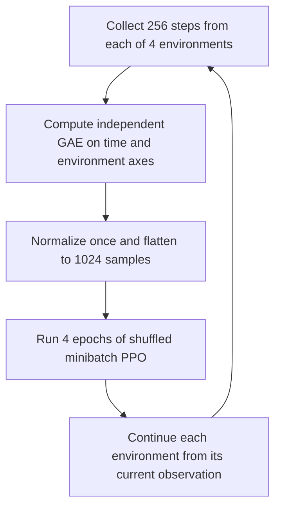

# Level 19: Vectorized PPO and Independent Environment Traces

This level extends the minibatch PPO trainer from Level 18 to collect experience from **four independent CartPole environments** through one vectorized interface.

Each environment contributes 256 transitions per rollout, giving the same 1024-transition training batch as before. The main challenge is preserving trajectory structure: each environment needs its own episode statistics, bootstrap values, boundary masks, and GAE trace. Only after those temporal quantities have been computed can the rollout be flattened and shuffled for PPO optimization.

## Learning objectives

- Create independent environments with `SyncVectorEnv`.
- Sample one action per environment with a batched policy forward pass.
- Store rollouts with separate time and environment dimensions.
- Handle `SAME_STEP` autoreset without confusing final and reset observations.
- Track episode returns and lengths independently for each environment.
- Compute boundary-aware GAE without mixing environment trajectories.
- Flatten rollout tensors while preserving sample alignment.
- Reuse the flattened batch for shuffled minibatch PPO updates.
- Count environment interactions correctly.
- Aggregate diagnostics across all minibatches in the final epoch.

## What changes from Level 18?

Level 18 collected 1024 consecutive transitions from one environment. Level 19 collects 256 transitions from each of four environments:

$$
N=4,
\qquad
T=256,
\qquad
B=TN=1024.
$$

Here:

- $N$ is the number of environments;
- $T$ is the number of rollout steps per environment;
- $B$ is the total number of transitions used for PPO optimization.

The batch size remains unchanged, but the experience comes from four trajectories instead of one.

This also changes the maximum within-rollout GAE horizon from 1024 steps to 256 steps per environment. The same total sample count therefore does not imply identical advantages, training curves, or evaluation results.

## Vectorized does not mean multiprocessing

The implementation uses `gym.vector.SyncVectorEnv`. It exposes a batched interface but steps its underlying environments serially. Batched policy inference processes all current observations together; this is not an `AsyncVectorEnv` multiprocessing implementation and does not establish a fourfold speedup. [Official SyncVectorEnv documentation](https://gymnasium.farama.org/api/vector/sync_vector_env/)

The environment factories create separate CartPole instances:

```python
env_fns = [
    lambda: gym.make("CartPole-v1")
    for _ in range(num_envs)
]
```

All instances share the same observation and action-space structure, but have their own environment state and episode progress.

## Actor and critic

The actor represents the categorical policy

$$
\pi_\theta(a\mid s)
$$

with a `4 → 32 → 2` network:

```text
observation → Linear(4, 32) → Tanh → Linear(32, 2) → logits
```

The critic estimates

$$
V_\phi(s)
$$

with a separate `4 → 32 → 1` network:

```text
observation → Linear(4, 32) → Tanh → Linear(32, 1) → value
```

The networks use separate Adam optimizers.

During collection, observations have shape `[N, 4]`. The policy produces logits with shape `[N, 2]`, and the categorical distribution samples actions with shape `[N]`.

## Batched action sampling

At vector step $t$, each environment $n$ receives an action sampled from the rollout policy:

$$
A_{t,n}
\sim
\pi_{\theta_{\mathrm{old}}}(\cdot\mid S_{t,n}).
$$

The selected action's old log-probability is stored:

$$
\ell_{t,n}^{\mathrm{old}}
= \log\pi_{\theta_{\mathrm{old}}}(A_{t,n}\mid S_{t,n}).
$$

Collection runs under `torch.no_grad()`. Old log-probabilities are detached samples from the policy that generated the rollout and remain fixed throughout optimization.

One call to `vector_env.step(actions)` advances every sub-environment once and returns batched observations, rewards, termination flags, truncation flags, and information.

## Time-major rollout layout

The collector stores one row per vector step. Each row contains data from all $N$ environments:

| Field | Shape after tensor conversion | Meaning |
| --- | --- | --- |
| `states` | `[T, N, 4]` | Observations used to choose actions. |
| `actions` | `[T, N]` | One sampled action per environment and step. |
| `rewards` | `[T, N]` | Rewards returned by the environments. |
| `next_states` | `[T, N, 4]` | Actual transition next states, before any reset. |
| `terminated` | `[T, N]` | True task-termination flags. |
| `episode_ends` | `[T, N]` | Termination or truncation flags. |
| `old_log_probs` | `[T, N]` | Old selected-action log-probabilities. |

The environment dimension must remain intact during GAE computation.

## Same-step autoreset

The vector environment explicitly uses:

```python
autoreset_mode=gym.vector.AutoresetMode.SAME_STEP
```

With this mode, an ended sub-environment is reset within the same `step(...)` call. Its returned observation is the new episode's reset observation, while its actual final observation is available in `info["final_obs"]`. This API distinction is documented by Farama. [Official autoreset guide](https://farama.org/Vector-Autoreset-Mode)

The collector needs **both** observations, but for different purposes:

| Situation | Stored transition `next_state` | Observation used for the next action |
| --- | --- | --- |
| Episode continues | `next_observations[n]` | `next_observations[n]` |
| Episode ends | `info["final_obs"][n]` | `next_observations[n]`, the reset observation |

The code first copies the returned batch:

```python
transition_next_states = next_observations.copy()
```

For each ended environment, it replaces only the stored transition next state:

```python
transition_next_states[env_index] = info["final_obs"][env_index]
```

It then keeps the returned observation batch for continued interaction:

```python
observations = next_observations
```

Using a reset observation in a truncated transition's value target would bootstrap from an unrelated new episode.

## Two masks per environment

Define:

$$
d_{t,n}
= \mathbf{1}
\left[
\text{the task truly terminates}
\right],
$$

and

$$
e_{t,n}
= \mathbf{1}
\left[
\text{the episode terminates or is truncated}
\right].
$$

The bootstrap mask is

$$
b_{t,n}=1-d_{t,n},
$$

while the trace mask is

$$
c_{t,n}=1-e_{t,n}.
$$

| Transition type | Bootstrap mask | Trace mask | Effect |
| --- | ---: | ---: | --- |
| Ordinary transition | $1$ | $1$ | Bootstrap and continue the same environment's GAE trace. |
| True termination | $0$ | $0$ | Neither bootstrap nor continue the trace. |
| Time-limit truncation | $1$ | $0$ | Bootstrap from the final observation, but stop at the reset boundary. |

An episode ending in one environment does not stop the traces of the others.

## Vectorized one-step TD errors

Let $S^+_{t,n}$ denote the actual next state of transition $(t,n)$, before autoreset. This is the state stored in `next_states`.

At target-generation time, the critic parameters are fixed at $\phi_0$. The TD error is

$$
\delta_{t,n}
= R_{t+1,n}
+\gamma(1-d_{t,n})
V_{\phi_0}(S^+_{t,n})
-V_{\phi_0}(S_{t,n}).
$$

The implementation computes all TD errors together:

```python
td_errors = rewards - values + gamma * bootstrap_mask * next_values
```

Every tensor in this expression has shape `[T, N]`.

For true termination, the next-state value is masked out. For truncation, it remains valid and must refer to the final observation rather than the reset observation.

## Independent vectorized GAE

For each environment, boundary-aware GAE follows:

$$
\hat{A}_{t,n}
= \delta_{t,n}
+\gamma\lambda(1-e_{t,n})\hat{A}_{t+1,n}.
$$

The recursion starts with

$$
\hat{A}_{T,n}=0
\qquad
\text{for every }n.
$$

The code uses a length-$N$ accumulator:

```python
gae = torch.zeros(N, dtype=rewards.dtype, device=rewards.device)

for t in reversed(range(T)):
    gae = td_errors[t] + gamma * gae_lambda * trace_mask[t] * gae
    advantages[t] = gae
```

At each iteration, `td_errors[t]`, `trace_mask[t]`, and `gae` have shape `[N]`. Their elementwise operations preserve one independent recursion per environment.

There is no term connecting $\hat{A}_{t,n}$ to another environment's advantage.

## Rollout endings still bootstrap

If an environment's episode continues after the final collected step, the collector does not reset it.

At the last rollout item,

$$
\hat{A}_{T-1,n}=\delta_{T-1,n},
$$

because the recursion beyond the buffer is initialized to zero. However, the TD error still includes

$$
\gamma V_{\phi_0}(S^+_{T-1,n})
$$

when the transition is nonterminal.

This is bootstrapping at a finite rollout boundary, not a claim that the underlying episode ended.

## Fixed value targets and global normalization

The raw advantages form critic targets:

$$
\hat{V}_{t,n}^{\mathrm{target}}
= \hat{A}_{t,n}
+V_{\phi_0}(S_{t,n}).
$$

The actor uses advantages normalized across **all $TN$ samples**:

$$
\widetilde{A}_{t,n}
= \frac{
\hat{A}_{t,n}-\mu_{\hat{A}}
}{
\sigma_{\hat{A}}+\epsilon_{\mathrm{num}}
}.
$$

Values, raw advantages, normalized advantages, and targets are prepared once under `torch.no_grad()`. Normalization uses `std(unbiased=False)`.

The old log-probabilities, normalized actor advantages, and critic targets stay fixed across every minibatch and PPO epoch.

## Flatten only after GAE

Once temporal credit assignment is complete, the time and environment dimensions can be combined:

$$
[T,N,D]\longrightarrow[TN,D]
$$

for states, and

$$
[T,N]\longrightarrow[TN]
$$

for actions, old log-probabilities, advantages, and value targets.

The implementation uses the same reshape order for every field. The flat sample index is

$$
i=tN+n.
$$

For $T=2$ and $N=2$, the mapping is:

| Flat index $i$ | Time $t$ | Environment $n$ |
| ---: | ---: | ---: |
| 0 | 0 | 0 |
| 1 | 0 | 1 |
| 2 | 1 | 0 |
| 3 | 1 | 1 |

This preserves state–action–advantage alignment.

Flattening before GAE would place different environments next to each other and could incorrectly propagate advantage information between unrelated trajectories.

## PPO objective on the flattened batch

The flattened batch uses the same PPO objective as Level 18.

For stored sample $i$, the current policy evaluates the same stored action:

$$
\ell_i^{\mathrm{new}}
= \log\pi_\theta(A_i\mid S_i).
$$

Its probability ratio is

$$
r_i(\theta)
= \exp\left(
\ell_i^{\mathrm{new}}-\ell_i^{\mathrm{old}}
\right).
$$

The clipped ratio is

$$
\bar{r}_i(\theta)
= \min\left(
\max\left(r_i(\theta),1-\epsilon\right),
1+\epsilon
\right).
$$

With $\epsilon=0.2$, clipped ratios lie in $[0.8,1.2]$. The original ratios are not forced into this interval.

The conservative surrogate is

$$
L_i^{\mathrm{CLIP}}(\theta)
= \min\left(
r_i(\theta)\widetilde{A}_i,
\bar{r}_i(\theta)\widetilde{A}_i
\right).
$$

No action is resampled inside the PPO update.

## Minibatch actor and critic losses

For a minibatch $I_j$ containing $m_j$ samples, the entropy-regularized actor loss is

$$
L_{\mathrm{actor},j}
= -\frac{1}{m_j}
\sum_{i\in I_j}L_i^{\mathrm{CLIP}}(\theta)
-\beta\frac{1}{m_j}
\sum_{i\in I_j}
\mathcal{H}\left(\pi_\theta(\cdot\mid S_i)\right).
$$

The entropy coefficient is $\beta=0.01$.

The critic minimizes

$$
L_{\mathrm{critic},j}
= \frac{1}{m_j}
\sum_{i\in I_j}
\left(
V_\phi(S_i)-\hat{V}_i^{\mathrm{target}}
\right)^2.
$$

Each minibatch produces one actor step and one critic step, with each optimizer following `zero_grad() → backward() → step()`.

## Shuffling and optimizer-step count

Every PPO epoch creates one permutation of all $B=TN$ samples and splits it into minibatches.

With minibatch size $M=64$:

$$
J=\left\lceil\frac{B}{M}\right\rceil
=16.
$$

With $K=4$ epochs:

$$
N_{\mathrm{steps,actor}}
= N_{\mathrm{steps,critic}}
= KJ
=64
$$

per rollout.

The reported `optimizer_steps` counts minibatch update pairs. A value of `64` means 64 actor steps **and** 64 critic steps, not 64 steps combined across both networks.

Every sample appears exactly once per epoch. A smaller final minibatch is retained if the total batch size is not divisible by $M$.

## Training flow



## Episode accounting per environment

The trainer keeps arrays of length $N$:

- `running_episode_returns`;
- `running_episode_lengths`.

At each vector step, each environment's reward and length are accumulated independently.

When environment $n$ ends an episode:

1. its completed return and length are added to the pooled histories;
2. only its own running counters are reset;
3. its next action uses the autoreset observation.

The other environments continue unaffected.

Partial episode statistics survive rollout boundaries. Completed histories use `extend(...)` and remain flat numeric lists.

The return plot uses the pooled order of completed episodes across all environments. It is not a separate curve for each environment, and its x-axis is not the number of vector steps.

## Environment-step accounting

One vector step produces $N$ real environment transitions. After update $u$:

$$
N_{\mathrm{interactions}}=uTN.
$$

For the default configuration:

$$
N_{\mathrm{interactions}}(10)
=10\times256\times4
=10240,
$$

and

$$
N_{\mathrm{interactions}}(100)
=100\times256\times4
=102400.
$$

The trainer must count $TN$, not just $T$, interactions per rollout.

## Final-epoch metric aggregation

Diagnostics combine all minibatches in the final PPO epoch.

If $x_j$ is a scalar minibatch mean, its sample-weighted epoch mean is

$$
\bar{x}
= \frac{\sum_j m_jx_j}{\sum_j m_j},
\qquad
\sum_jm_j=B.
$$

The implementation uses `indices.numel()` as $m_j$.

Actor and critic losses are weighted this way. Entropy and ratios are accumulated as per-sample sums, then divided by $B$.

The clip fraction is

$$
f_{\mathrm{clip}}
= \frac{1}{B}
\sum_i
\mathbf{1}
\left[
\left|r_i-1\right|>\epsilon
\right].
$$

The ratio range uses the minimum and maximum over every final-epoch minibatch:

$$
r_{\min}=\min_i r_i,
\qquad
r_{\max}=\max_i r_i.
$$

Because the policy changes after each minibatch, these diagnostics summarize the final epoch's successive pre-update minibatch evaluations. They are not a fresh full-batch evaluation of one final policy snapshot.

## Tensor shapes

| Quantity | Collection / GAE shape | After flattening |
| --- | --- | --- |
| States | `[T, N, 4]` | `[TN, 4]` |
| Next states | `[T, N, 4]` | Not needed for PPO minibatches |
| Actions | `[T, N]` | `[TN]` |
| Rewards | `[T, N]` | Not needed after target preparation |
| Termination and episode-end masks | `[T, N]` | Not needed after GAE |
| Old log-probabilities | `[T, N]` | `[TN]` |
| Values, next values, TD errors | `[T, N]` | Not needed after target preparation |
| Actor advantages | `[T, N]` | `[TN]` |
| Value targets | `[T, N]` | `[TN]` |
| GAE accumulator | `[N]` | Not applicable |

For a minibatch of $m_j$ samples, states have shape `[m_j, 4]` and all per-sample loss quantities have shape `[m_j]`. Both losses are scalars.

## Training configuration

| Parameter | Value |
| --- | ---: |
| Environment | `CartPole-v1` |
| Vector environment | `SyncVectorEnv` |
| Autoreset mode | `SAME_STEP` |
| Number of environments $N$ | `4` |
| Steps per environment $T$ | `256` |
| Total rollout batch size $B$ | `1024` |
| PPO updates | `100` |
| Total planned interactions | `102400` |
| Minibatch size $M$ | `64` |
| Minibatches per epoch | `16` |
| PPO epochs $K$ | `4` |
| Actor / critic steps per rollout | `64` each |
| Discount factor $\gamma$ | `0.99` |
| GAE parameter $\lambda$ | `0.95` |
| Clipping parameter $\epsilon$ | `0.2` |
| Entropy coefficient $\beta$ | `0.01` |
| Actor learning rate | `3e-4` |
| Critic learning rate | `1e-3` |
| Hidden dimension | `32` |
| Report interval | `10` updates |
| Return smoothing window | `50` completed episodes |
| Evaluation episodes | `20` |
| Base seed | `32268` |

The plot is saved as `ppo_vectorized_cartpole.png`.

## Implementation map

| Component | Purpose |
| --- | --- |
| `PolicyNetwork` | Produces batched categorical action logits. |
| `ValueNetwork` | Predicts values while preserving leading time/environment dimensions. |
| `make_vector_env(...)` | Creates independent CartPole instances with explicit same-step autoreset. |
| `collect_vector_rollout(...)` | Collects time-major vector data and preserves actual final observations. |
| `rollout_to_tensors(...)` | Converts the vector rollout into aligned tensors and dtypes. |
| `compute_gae(...)` | Runs an independent reverse-time recurrence for each environment. |
| `flatten_vector_batch(...)` | Combines time and environment axes after GAE. |
| `make_minibatch_indices(...)` | Shuffles all flat indices once per epoch without dropping samples. |
| `calculate_ppo_terms(...)` | Computes probability ratios and conservative clipped surrogates. |
| `update_ppo_from_rollout(...)` | Prepares targets once and performs shuffled minibatch updates. |
| `train(...)` | Maintains per-environment episode state and interaction counts. |
| `plot_training_history(...)` | Plots pooled completed-episode returns and their moving average. |
| `collect_episode(...)` | Collects complete single-environment evaluation episodes. |
| `evaluate_policy(...)` | Evaluates the learned stochastic policy without gradient updates. |

## Interpreting the output

- **Mean recent return:** mean of the last 50 completed episodes pooled across all environments.
- **Actor / critic losses:** sample-weighted final-epoch means, not the final random minibatch alone.
- **Mean entropy:** for two actions, the maximum is $\log2\approx0.693$.
- **Mean ratio:** should satisfy $r_{\min}\leq\bar{r}\leq r_{\max}$; a mean near one does not imply every ratio is near one.
- **Ratio range:** original ratios can exceed the clipping interval.
- **Clip fraction:** must lie in $[0,1]$; zero is valid when no sampled ratio crosses the boundary.
- **Optimizer steps:** should be `64` for the default rollout, minibatch size, and epoch count.
- **Final epoch:** should be `4`.
- **Environment steps:** increase by `1024` per update.
- **Completed episodes:** total across all environments, independent of the update counter.

No particular training return or evaluation score is guaranteed. Correct tensor handling and finite losses do not by themselves prove that the policy has learned a strong controller.

## Evaluation and seeds

Evaluation uses a separate, non-vectorized CartPole environment and collects 20 complete episodes under `torch.no_grad()`.

Actions are still sampled from the learned categorical policy. This is stochastic-policy evaluation, not greedy `argmax` evaluation.

Training seeds the vector reset once. Gymnasium expands an integer reset seed into an offset seed for each sub-environment. Evaluation uses `SEED + NUM_UPDATES` as its base seed, then increments it per episode. [Official reset implementation](https://gymnasium.farama.org/_modules/gymnasium/vector/sync_vector_env/)

## Validation checklist

A Level 19 test suite should verify:

1. environment instances are independent and autoreset mode is explicitly `SAME_STEP`;
2. collection produces exactly $T$ transitions per environment;
3. rollout shapes are `[T, N, D]` and `[T, N]` as appropriate;
4. stored old log-probabilities match the sampled actions and rollout policy;
5. ended transitions store `final_obs`, not reset observations;
6. next interaction observations remain the returned reset observations;
7. episode counters reset only for the ended environments;
8. partial episodes continue across rollout boundaries;
9. termination disables bootstrapping, while truncation allows it;
10. GAE traces stop at episode boundaries and never mix environments;
11. nonterminal rollout endings bootstrap from the final next-state value;
12. flattening preserves every state–action–advantage–target association;
13. minibatches cover every flat sample exactly once per epoch;
14. advantages and targets are computed once and stay detached;
15. both networks update and losses remain finite scalars;
16. unequal minibatches receive correct sample-weighted metrics;
17. optimizer-step and environment-interaction counts are correct;
18. evaluation collects complete separately seeded episodes.

### Hand-checking environment independence

With $\gamma=\lambda=1$, unit rewards, zero values, and episode-end flags

$$
e=
\begin{bmatrix}
0 & 1\\
1 & 0\\
0 & 0
\end{bmatrix},
$$

the expected advantages are

$$
\hat{A}=
\begin{bmatrix}
2 & 1\\
1 & 2\\
1 & 1
\end{bmatrix}.
$$

Each column is its own reverse-time recurrence. A boundary in one column has no effect on the other.

### Current test-file status

The uploaded `test_ppo_vectorized_cartpole.py` includes a vector-independence GAE test, but also retains several Level 18 single-environment tests.

Before treating it as a complete verification of Level 19:

- convert the one-dimensional GAE test inputs to `[T, N]`;
- replace calls to removed `collect_rollout(...)` with vector-collector tests;
- update `train(...)` tests to use `vector_env` and `steps_per_env`;
- add explicit same-step final-observation and flattening-alignment checks.

Do not report the suite as passing against the vectorized implementation until those retained tests are adapted and rerun.

## Run the project

Install dependencies:

```bash
python -m pip install numpy "gymnasium>=1.1" torch matplotlib pytest
```

Gymnasium 1.1 introduced explicit support for the autoreset modes used here; older installations may not support this constructor API. [Official autoreset guide](https://farama.org/Vector-Autoreset-Mode)

From the Level 19 directory:

```bash
python ppo_vectorized_cartpole.py
python -m pytest -q test_ppo_vectorized_cartpole.py
```

The test command assumes the retained single-environment tests have been adapted as described above.

## Level 18 versus Level 19

| Property | Level 18: single-environment PPO | Level 19: vectorized PPO |
| --- | --- | --- |
| Environment instances | 1 | 4 |
| Steps per environment per rollout | 1024 | 256 |
| Total rollout samples | 1024 | 1024 |
| Pre-GAE layout | `[T, D]` / `[T]` | `[T, N, D]` / `[T, N]` |
| GAE accumulator | Scalar | One value per environment |
| Episode statistics | One pair of running counters | One pair per environment |
| Reset handling | Explicit single-environment reset | Same-step autoreset and final-observation recovery |
| Flattening | Not required | Required after GAE |
| Minibatch size | 64 | 64 |
| PPO epochs | 4 | 4 |
| Actor / critic steps per rollout | 64 each | 64 each |

Level 19 changes experience collection and trajectory bookkeeping. PPO's clipped policy objective remains the same.

## Connection to language-model RL and RLVR

The transferable idea is to collect several independent trajectories while keeping credit assignment separate.

In language-model reinforcement learning, a training batch may contain multiple generated sequences. Old selected-token log-probabilities and advantage signals must remain aligned, and sequence boundaries must prevent credit from leaking into unrelated generations.

Vectorized CartPole makes the same bookkeeping problem small and visible: preserve trajectory structure first, then flatten or batch samples for optimization. RLVR adds verifiable reward signals; this project is a practice implementation of relevant RL mechanics, not language-model fine-tuning itself.

## Scope and limitations

This implementation includes vectorized collection, same-step final-observation handling, independent GAE traces, aligned flattening, clipped PPO, shuffled minibatches, entropy regularization, and sample-weighted diagnostics.

It does not include:

- asynchronous multiprocessing environments;
- distributed actors or learners;
- explicit GPU device management;
- value-function clipping;
- gradient-norm clipping;
- target-KL early stopping;
- learning-rate schedules;
- observation or reward normalization;
- checkpointing;
- deterministic evaluation.

## Main takeaway

Temporal credit assignment must stay inside the correct environment:

$$
\boxed{
\hat{A}_{t,n}
= \delta_{t,n}
+\gamma\lambda(1-e_{t,n})\hat{A}_{t+1,n}
}.
$$

Only afterward should the rollout be flattened:

$$
\boxed{
i=tN+n,
\qquad
B=TN
}.
$$

The central rule is: keep trajectories and reset boundaries separate during collection and GAE, preserve alignment when flattening, and then reuse the combined batch for shuffled PPO updates.
