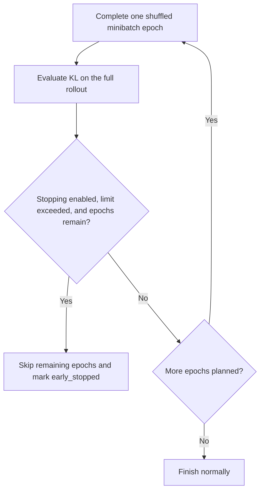

# Level 20: PPO with Approximate KL Monitoring and Early Stopping

This level extends the vectorized PPO trainer from Level 19 with **policy-change diagnostics and KL-based early stopping**.

PPO clipping limits the incentive for certain large probability-ratio changes, but it does not enforce a strict bound on the distance between policies. This implementation therefore measures how far the current actor has moved from the policy that collected the rollout. If the approximate KL exceeds a threshold after a complete PPO epoch, any remaining optimization epochs for that rollout are skipped.

The rollout collector, independent GAE traces, aligned flattening, and shuffled minibatches remain unchanged. The new focus is measuring policy drift correctly and making the stopping decision at the correct point in the update loop.

## Learning objectives

- Distinguish PPO clipping from a KL constraint.
- Compute two approximate KL diagnostics from selected-action log-probabilities.
- Use `torch.expm1` for small log-probability differences.
- Understand why the signed KL estimate can be negative.
- Reject invalid inputs and nonfinite diagnostic results.
- Re-evaluate the entire rollout after each complete optimization epoch.
- Stop remaining epochs without discarding completed actor or critic updates.
- Preserve sample-weighted metrics from the last completed epoch.
- Distinguish fewer optimizer steps from fewer environment interactions.

## What changes from Level 19?

| Component | Level 19 | Level 20 |
| --- | --- | --- |
| Collection | Four independent vectorized environments | Unchanged |
| Rollout size | 1024 transitions | Unchanged |
| GAE and flattening | Independent traces, then aligned flattening | Unchanged |
| PPO optimization | Four shuffled minibatch epochs | Up to four epochs |
| Policy-change diagnostics | Ratios and clip fraction | Ratios, clip fraction, and two KL estimates |
| KL evaluation | Not included | Full-rollout evaluation after each completed epoch |
| Early stopping | Not included | Skip remaining epochs when the KL limit is exceeded |

## Project files

- `ppo_kl_cartpole.py`: networks, rollout collection, GAE, PPO updates, KL diagnostics, training, and evaluation.
- `test_ppo_kl_cartpole.py`: deterministic tests for vector-batch behavior, KL calculations, stopping decisions, and update-loop integration.
- `ppo_kl_cartpole.png`: generated plot of completed training-episode returns and their moving average.

## Actor, critic, and rollout structure

The actor is a categorical policy $\pi_\theta(a\mid s)$ with a `4 → 32 → 2` network. The critic is a separate value estimator $V_\phi(s)$ with a `4 → 32 → 1` network. Both use a `Tanh` hidden activation and their own Adam optimizer.

Experience is collected through `SyncVectorEnv` with explicit `SAME_STEP` autoreset:

$$
N=4,\qquad T=256,\qquad B=TN=1024.
$$

Here, $N$ is the number of environments, $T$ is the number of collected steps per environment, and $B$ is the flattened training-batch size. `SyncVectorEnv` uses a vectorized interface; this implementation does not use asynchronous multiprocessing.

| Quantity | Before flattening | During PPO optimization |
| --- | --- | --- |
| States | `[T, N, 4]` | `[B, 4]` |
| Actions | `[T, N]` | `[B]` |
| Old selected-action log-probabilities | `[T, N]` | `[B]` |
| Actor advantages | `[T, N]` | `[B]` |
| Value targets | `[T, N]` | `[B]` |
| Full-rollout new log-probabilities | Not needed during collection | `[B]`, recomputed after each epoch |

When an environment ends an episode, the collector stores `info["final_obs"][env_index]` as that transition's actual next state. The returned reset observation is used for the next action, not for the previous episode's bootstrap target.

Episode returns and lengths are maintained separately for each environment. Partial episodes continue across rollout boundaries.

## Fixed GAE advantages and value targets

Let $d_{t,n}$ indicate true task termination, and let $e_{t,n}$ indicate termination or truncation. Let $S^+_{t,n}$ denote the actual next state before autoreset. Using the critic snapshot $\phi_0$ available before optimization:

$$
\delta_{t,n}
=R_{t+1,n}
+\gamma(1-d_{t,n})V_{\phi_0}(S^+_{t,n})
-V_{\phi_0}(S_{t,n}).
$$

The independent reverse-time GAE recurrence is

$$
\hat{A}_{t,n}
=\delta_{t,n}
+\gamma\lambda(1-e_{t,n})\hat{A}_{t+1,n},
\qquad
\hat{A}_{T,n}=0.
$$

True termination disables bootstrapping. Truncation permits bootstrapping from the final observation but stops the trace at the episode boundary. A rollout cutoff also ends the available recursion, while its final nonterminal TD error still includes a next-state value.

The fixed critic target is

$$
\hat{V}_{t,n}=\hat{A}_{t,n}+V_{\phi_0}(S_{t,n}).
$$

Only the actor advantages are normalized, once over the entire rollout:

$$
\tilde{A}_{t,n}
=\frac{\hat{A}_{t,n}-\mu_A}{\sigma_A+\varepsilon_{\mathrm{num}}}.
$$

The implementation uses the population standard deviation, `std(unbiased=False)`, and the tensor dtype's machine epsilon. Critic targets use the raw, unnormalized advantages.

Old log-probabilities, normalized actor advantages, and critic targets are detached and remain fixed across all epochs. GAE is computed before flattening so that unrelated environment trajectories cannot mix.

## PPO objective

For flattened sample $i$, the stored action $A_i$ is evaluated under both the rollout policy and the current actor:

$$
\ell_i^{\mathrm{old}}
=\log\pi_{\theta_{\mathrm{old}}}(A_i\mid S_i),
\qquad
\ell_i^{\mathrm{new}}
=\log\pi_\theta(A_i\mid S_i).
$$

No new action is sampled while evaluating the loss or KL. The comparison must concern the same stored state and action.

Define the log-ratio and probability ratio:

$$
\Delta_i=\ell_i^{\mathrm{new}}-\ell_i^{\mathrm{old}},
\qquad
r_i=e^{\Delta_i}
=\frac{\pi_\theta(A_i\mid S_i)}{\pi_{\theta_{\mathrm{old}}}(A_i\mid S_i)}.
$$

For a minibatch $\mathcal{M}$ with $m$ samples, the minimized actor loss is

$$
L_{\mathrm{actor}}
=-\frac{1}{m}\sum_{i\in\mathcal{M}}
\min\left(
r_i\tilde{A}_i,
\operatorname{clip}(r_i,1-\epsilon,1+\epsilon)\tilde{A}_i
\right)
-\frac{\beta}{m}\sum_{i\in\mathcal{M}}H\left(\pi_\theta(\cdot\mid S_i)\right).
$$

The critic minimizes mean squared error against the fixed targets:

$$
L_{\mathrm{critic}}
=\frac{1}{m}\sum_{i\in\mathcal{M}}
\left(V_\phi(S_i)-\hat{V}_i\right)^2.
$$

This level does **not** add a KL penalty to the actor loss. KL is a diagnostic and an early-stopping signal.

## Why monitor KL as well as clipping?

Clipping modifies the surrogate objective, not the policy probabilities themselves. Original ratios can still move outside the clipping interval, and repeated minibatch updates can accumulate policy drift.

A mean ratio near one does not imply that every action probability is nearly unchanged. Likewise, a zero clip fraction does not imply zero KL: probabilities may change without any sampled ratio crossing the clipping boundary.

KL provides a complementary measure of the change from the rollout policy to the current policy.

## Approximate KL diagnostics

### Direction of the comparison

The diagnostics target the old-to-new conditional policy divergence, averaged over rollout states:

$$
D_{\mathrm{KL}}^{\mathrm{old}\to\mathrm{new}}
=\frac{1}{B}\sum_{i=1}^{B}\sum_a
\pi_{\theta_{\mathrm{old}}}(a\mid S_i)
\log\frac{\pi_{\theta_{\mathrm{old}}}(a\mid S_i)}{\pi_\theta(a\mid S_i)}.
$$

The implementation does not compute this exact all-action sum. It uses the selected actions stored in the rollout. These estimates measure conditional action-policy drift on collected states, not an exact divergence between complete trajectory distributions.

### Signed estimate

The first diagnostic is

$$
\widehat{D}_{\mathrm{signed}}
=-\frac{1}{B}\sum_{i=1}^{B}\Delta_i
=\frac{1}{B}\sum_{i=1}^{B}
\left(\ell_i^{\mathrm{old}}-\ell_i^{\mathrm{new}}\right).
$$

It is returned as `signed_approx_kl`.

For fixed policies, averaging the log-probability difference over old-policy actions estimates the old-to-new KL. However, an individual sample can contribute a negative value, and a finite sample average can also be negative. **A negative `signed_approx_kl` is not automatically an error.**

This signed diagnostic is not used for early stopping.

### Nonnegative estimate

The stopping diagnostic is

$$
\widehat{D}_{+}
=\frac{1}{B}\sum_{i=1}^{B}
\left(e^{\Delta_i}-1-\Delta_i\right)
=\frac{1}{B}\sum_{i=1}^{B}
\left(r_i-1-\log r_i\right).
$$

It is returned as `approx_kl`.

In exact arithmetic, every term is nonnegative because

$$
e^x\geq1+x.
$$

For fixed policies with common action support, the identity $\mathbb{E}_{a\sim\pi_{\mathrm{old}}}[r]=1$ gives

$$
\mathbb{E}_{a\sim\pi_{\mathrm{old}}}
\left[r-1-\log r\right]
=D_{\mathrm{KL}}\left(\pi_{\mathrm{old}}\,\Vert\,\pi_{\mathrm{new}}\right).
$$

This explains the estimator's direction. Its finite-rollout value is still an approximation, not an exact KL bound or an unbiased guarantee for a policy fitted to that same rollout.

### Numerical stability

The code calculates the diagnostics with

```python
log_ratios = new_log_probs - old_log_probs
signed_approx_kl = -log_ratios.mean()
approx_kl = (torch.expm1(log_ratios) - log_ratios).mean()
```

`torch.expm1(x)` evaluates the quantity $e^x-1$ more accurately near zero than directly subtracting one from an exponential. For small changes:

$$
e^x-1-x=\frac{x^2}{2}+O(x^3).
$$

Consequently, very small positive KL values are valid. If the old and current selected-action log-probabilities are identical, both diagnostics are zero.

### Input and result validation

`compute_kl_diagnostics(...)` runs under `torch.no_grad()` and returns a dictionary containing two Python floats. It requires:

- nonempty, one-dimensional, shape-matched log-probability tensors;
- detached old log-probabilities;
- finite old and new log-probabilities;
- finite diagnostic results, including after exponentiation;
- `approx_kl` no lower than `-1e-8`.

The last condition permits tiny negative floating-point roundoff around zero. The current implementation accepts such a value without clamping it. A materially negative nonnegative estimate is rejected, but a negative signed estimate is permitted.

Finite inputs alone are insufficient: a sufficiently large log-ratio can overflow the exponential and must be rejected. Zero and negative log-probabilities are normal for discrete action probabilities and are not rejected merely because of their sign.

## Complete-epoch KL early stopping

After all minibatches in an epoch have updated both networks, the trainer:

1. Evaluates the current actor on all flattened rollout states.
2. Computes log-probabilities for all stored actions under `torch.no_grad()`.
3. Compares them with the original, unchanged rollout log-probabilities.
4. Computes both KL diagnostics over all $B$ samples.
5. Decides whether to skip the remaining epochs.

The stopping helper uses the strict condition

$$
\widehat{D}_{+}>c\,\tau,
$$

where $\tau$ is `target_kl` and $c$ is `stop_multiplier`. With the default settings:

$$
\tau=0.01,\qquad c=1.5,\qquad c\tau=0.015.
$$

A KL exactly equal to the threshold does not trigger the helper. The update loop sets `early_stopped=True` only if the limit is exceeded **and at least one planned epoch remains to be skipped**.

Setting `target_kl=None` disables stopping, but KL diagnostics are still computed. Nonfinite KL values are rejected even when stopping is disabled. An enabled target and the multiplier must be finite and strictly positive.

Important consequences:

- The first epoch is completed before its KL is checked.
- No epoch is interrupted halfway through its minibatches.
- Completed actor and critic updates are kept; nothing is rolled back.
- Stopping skips remaining epochs for both networks, not just the actor.
- The next training update still collects a fresh rollout.
- A high KL on the last planned epoch can coexist with `early_stopped=False`, because no epochs were skipped.
- This is a safeguard against additional drift, not a hard constraint that guarantees KL remains below the threshold.



## Metrics: two different measurement times

Level 20 preserves the last completed epoch's sample-weighted loss, entropy, and ratio metrics. KL is measured differently: it is a fresh full-rollout evaluation after that epoch's optimizer steps.

| Returned metric | Meaning and measurement time |
| --- | --- |
| `update_epoch` | Number of fully completed epochs for the current rollout. |
| `optimizer_steps` | Cumulative actor/critic minibatch update pairs for this rollout. |
| `actor_loss` | Sample-weighted mean of pre-step actor losses in the last completed epoch. |
| `critic_loss` | Sample-weighted mean of pre-step critic losses in that epoch. |
| `mean_entropy` | Mean entropy over that epoch's successive pre-step minibatch evaluations. |
| `mean_ratio` | Mean original ratio over those minibatch evaluations. |
| `min_ratio`, `max_ratio` | Global ratio extrema across that epoch's minibatches. |
| `clip_fraction` | Fraction of those samples with original ratios outside the clipping interval. |
| `approx_kl` | Full-rollout nonnegative KL estimate for the final actor after the completed epoch. |
| `signed_approx_kl` | Full-rollout signed estimate for that same actor snapshot. |
| `early_stopped` | Whether KL stopping actually skipped any planned epochs. |

For minibatch mean $x_j$ and minibatch size $m_j$, aggregation uses

$$
\bar{x}=\frac{\sum_jm_jx_j}{\sum_jm_j},
\qquad
\sum_jm_j=B.
$$

This preserves correct weighting when the final minibatch is smaller. Entropy and ratios are accumulated as per-sample sums. The clip fraction is

$$
f_{\mathrm{clip}}
=\frac{1}{B}\sum_i\mathbf{1}\left[\lvert r_i-1\rvert>\epsilon\right].
$$

Because the actor changes between minibatches, these ordinary epoch metrics do not describe one final policy snapshot. The KL diagnostics do. They should not be expected to match a KL inferred from the displayed mean ratio alone.

Both KL values are returned by `update_ppo_from_rollout(...)`. The supplied training loop prints `approx_kl` as `KL:` and prints `early_stopped`; it does not currently print the signed diagnostic.

## Optimizer-step and environment-step accounting

With batch size $B$, minibatch size $M$, and $Q$ completed epochs:

$$
J=\left\lceil\frac{B}{M}\right\rceil,
\qquad
N_{\mathrm{steps,actor}}
=N_{\mathrm{steps,critic}}
=QJ.
$$

The default batch has 16 minibatches per epoch. Therefore:

| Completed epochs | `optimizer_steps` | Actor steps | Critic steps | `early_stopped` with four planned epochs |
| --- | ---: | ---: | ---: | --- |
| 1 | 16 | 16 | 16 | `True` if KL skips epochs 2–4 |
| 2 | 32 | 32 | 32 | `True` if KL skips epochs 3–4 |
| 3 | 48 | 48 | 48 | `True` if KL skips epoch 4 |
| 4 | 64 | 64 | 64 | `False` |

`optimizer_steps` counts update pairs, not actor and critic steps added together, and resets for each new rollout.

Early stopping does not reduce the number of already collected transitions. After training update $u$:

$$
N_{\mathrm{environment\ interactions}}=uTN.
$$

Every default update adds 1024 interactions, whether it completes one PPO epoch or all four. The 100-update training run collects 102400 interactions.

## Training configuration

| Parameter | Default |
| --- | --- |
| Environment | `CartPole-v1` |
| Vector environment / autoreset | `SyncVectorEnv` / `SAME_STEP` |
| Number of environments | `4` |
| Steps per environment | `256` |
| Rollout batch size | `1024` |
| Minibatch size | `64` |
| Maximum PPO epochs per rollout | `4` |
| Training updates | `100` |
| Discount factor $\gamma$ | `0.99` |
| GAE parameter $\lambda$ | `0.95` |
| PPO clipping parameter $\epsilon$ | `0.2` |
| Entropy coefficient $\beta$ | `0.01` |
| Target KL $\tau$ | `0.01` |
| KL stop multiplier $c$ | `1.5` |
| Effective stopping threshold | `0.015` |
| Actor learning rate | `3e-4` |
| Critic learning rate | `1e-3` |
| Hidden dimension | `32` |
| Report interval | `10` updates |
| Return smoothing window | `50` completed episodes |
| Evaluation episodes | `20` |
| Base seed | `32268` |

## Implementation map

| Component | Responsibility |
| --- | --- |
| `PolicyNetwork`, `ValueNetwork` | Separate categorical actor and scalar critic. |
| `make_vector_env(...)` | Independent CartPole environments with explicit same-step autoreset. |
| `collect_vector_rollout(...)` | Time-major experience, actual final observations, and per-environment episode bookkeeping. |
| `rollout_to_tensors(...)` | Aligned tensor conversion with appropriate dtypes. |
| `compute_gae(...)` | Independent boundary-aware GAE and fixed value targets. |
| `flatten_vector_batch(...)` | Combine time and environment dimensions after GAE. |
| `make_minibatch_indices(...)` | New shuffled permutation per epoch without dropping samples. |
| `calculate_ppo_terms(...)` | Ratios, clipped ratios, and conservative surrogates. |
| `compute_kl_diagnostics(...)` | Validated signed and nonnegative KL estimates as Python floats. |
| `should_ppo_stop_for_kl(...)` | Strict threshold decision and optional disabling with `None`. |
| `update_ppo_from_rollout(...)` | Fixed targets, complete minibatch epochs, post-epoch full-rollout KL, and early stopping. |
| `train(...)` | Fresh rollouts, persistent episode state, interaction counts, and reporting. |
| `plot_training_history(...)` | Raw completed-episode returns and moving-average plot. |
| `collect_episode(...)`, `evaluate_policy(...)` | Complete single-environment stochastic-policy evaluation episodes. |

## Evaluation and output

Evaluation uses a separate, non-vectorized CartPole environment and collects 20 complete episodes under `torch.no_grad()`. Actions are sampled from the learned categorical policy; evaluation is not greedy `argmax` action selection.

NumPy and PyTorch are seeded with `SEED`. Training seeds the initial vector reset once and does not reset every environment at every rollout boundary. Evaluation uses `SEED + NUM_UPDATES + episode_index` for each episode's environment seed. Environment seeding alone does not make sampled policy actions deterministic.

The script saves `ppo_kl_cartpole.png` and reports:

- recent mean training return;
- actor and critic losses, entropy, ratios, and clip fraction;
- completed epochs and optimizer-step count;
- total environment interactions and completed episodes;
- approximate KL and whether remaining epochs were skipped;
- first-50 and final-50 training-return means, followed by the evaluation-return mean.

The plot pools completed episodes from all environments. Its horizontal axis is completed training episodes, not vector steps or PPO updates.

There is no fixed training-score guarantee. `early_stopped=False` is normal when policy changes stay below the limit, stopping is disabled, or the limit is exceeded only after the final planned epoch. Repeated early stopping is a signal to inspect update sizes and learning rates, not proof that training is broken.

## Tests

The supplied `test_ppo_kl_cartpole.py` covers:

1. Independent `SAME_STEP` vector environments, boundary-aware GAE, and aligned flattening, including noncontiguous inputs.
2. Complete minibatch coverage and retention of a smaller final minibatch.
3. Zero KL for unchanged log-probabilities and a hand-calculated nonzero example.
4. Negative signed estimates and stable near-zero nonnegative estimates.
5. Detached diagnostic evaluation without modifying input tensors.
6. Shape checks, detached old logs, finite inputs, exponential overflow, and negative-roundoff tolerance.
7. Strict threshold comparison, the default multiplier, and disabled stopping.
8. Rejection of invalid targets, multipliers, and nonfinite KL values.
9. One full-rollout KL evaluation after each complete actor/critic epoch.
10. Early stopping after the correct epoch and correct optimizer-step counts.
11. One-time GAE computation, fixed targets, and real updates to both networks.
12. Sample-weighted metrics from the last completed epoch, including after early stopping.
13. Forwarding KL settings through `train(...)`, carrying episode state, and counting vector interactions.

The tests use tiny controlled batches rather than requiring a particular CartPole learning score. Running them checks implementation mechanics; it does not establish statistical performance across seeds.

## Run the project

Install dependencies in your Python environment:

```bash
python -m pip install numpy "gymnasium>=1.1" torch matplotlib pytest
```

The Gymnasium installation must support the explicit vector autoreset API used by the code.

From the Level 20 directory, with the module named `ppo_kl_cartpole.py`:

```bash
python ppo_kl_cartpole.py
python -m pytest -q test_ppo_kl_cartpole.py
```

The test file imports `ppo_kl_cartpole`. Run the commands from the project directory, using the actual test-file path if your tests live in a `tests/` subdirectory.

## Connection to language-model RL and RLVR

The transferable idea is to monitor how much a policy changes while reusing generated experience for several optimization passes. In language-model PPO, selected-token log-probabilities play a role analogous to selected-action log-probabilities here, with additional masking and sequence-aggregation choices.

Two policy comparisons must remain distinct:

- **Current versus rollout-old policy:** measures update drift on the collected data, as in this level.
- **Current versus a separate reference model:** can provide a regularization signal in language-model post-training.

The rollout-old policy is the actor that generated the current batch; it changes when a new rollout is collected. It is not automatically a fixed supervised reference model. Reference-policy regularization is a separate design choice, and verifiable rewards do not themselves require a particular KL penalty.

This level implements CartPole PPO safeguards, not language-model fine-tuning or RLVR itself.

## Scope and limitations

Included: vectorized collection, final-observation recovery, independent GAE, detached fixed targets, aligned flattening, shuffled minibatch PPO, entropy regularization, sample-weighted metrics, approximate KL diagnostics, and complete-epoch early stopping.

Not included: a KL penalty in the actor objective, exact all-action KL, per-minibatch stopping, rollback of oversized updates, value-function clipping, gradient-norm clipping, learning-rate schedules, adaptive KL targets, observation/reward normalization, checkpointing, distributed training, explicit GPU device management, or deterministic-action evaluation.

## Main takeaway

**Clipping shapes the objective; KL monitoring decides whether to continue reusing a rollout.**

$$
\widehat{D}_{+}
=\frac{1}{B}\sum_i
\left(e^{\Delta_i}-1-\Delta_i\right).
$$

After each complete PPO epoch, compare this full-rollout diagnostic with the configured threshold. If the limit is exceeded and epochs remain, keep the completed updates and move on to fresh experience.
